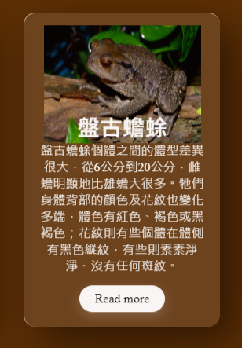

# frog-webpage
The project from USR.  
***
The third version is coming in 2021/5/3!  
Because we will have a illustrated book in this project to promote frogs! So I create a new website, please check it in Frog_IB.html.  
The homepage.html and frog.html are updated too, I will design it continuously, I think we can do a fancy website before project ended!!  
And the most important thing, the tutorial I learned this time is from [here](https://www.youtube.com/watch?v=hv0rNxr1XXk&list=PLVcDoPkbpyX_PqeHxuJ2XO7ntgQumChu-&index=14), check it out!  
I have to say, Glassmorphism is an super amazing effect in promote some specific stuff!  

***
I update the second vertion at 2021/4/19.  
All of the resource is in the new folder called "frog_0419".  
This version I researched the responsive imgmap in the HTML and embedded the jquery imgmap in website.  
The resource is from [here](https://github.com/stowball/jQuery-rwdImageMaps), and the License is also in the "frog_0419" folder.  

Learn a lot, Thanks a lot!!  

As you can see, the Homepage.html has a map, use jquery syntax above website I mentioned, we can hover at specific location and go to the next website.  
The most important thing is that the range of area will not leave the relative position of the origin image when we resize the web, that's amazing!!  

***

I update the first vertion at 2021/4/12.  
All resorce is in the "frog" folder.  
Open the frog.html to see the webpage.  
```js
//Here is the animation in the article <p>
function showPrag(x,i){
	const storyprag  = document.querySelectorAll('.story-prag');
	console.log(i);
	for(j = 0; j < storyprag.length; j++){
		if(j == i){
			storyprag[j].style.display = "inline";
		}
		else{
			storyprag[j].style.display = "none";
		}
	}
}
```


